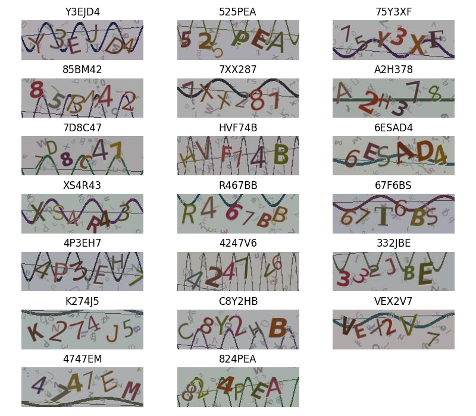

## 介绍

使用 yolov8 模型，用了 250 个训练样本，随机又验证了 100 张，模型准确率在 97% 左右。 仅导出 onnx 未做任何优化。

随便测试了 20 张：

几乎都是正确的。一般重叠程度过大的会识别错误。

> PS：怎么这个 `T` 还是识别错了... 
> 实际上应该是 `C`、`K` 可能识别率会低一点，因为这俩出现频率比较低。
> 训练集数据也比较少。
> 
> failed 文件夹放了一些识别失败的例子，还有更高精度要求，~~可待有时间再优化重新训练~~能跑就行。

模型不会优化，能跑就行🚗

其实这个验证码现在已经没啥用了，用来学习交流的
